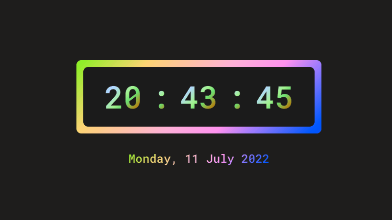

## Digital Clock

A digital clock built with HTML, CSS, and JavaScript. The goal of this project was to practice the Date Object and the `setInterval()` method in JavaScript.

 

 

### Link:

- [Live App](https://julianachagas.github.io/digital-clock/)

### Technologies

- HTML
- CSS
- JavaScript

### Concepts practiced

- DOM manipulation
- Date object
- `setInterval()` method

 

---

##### Made with 💜 by Juliana Chagas
